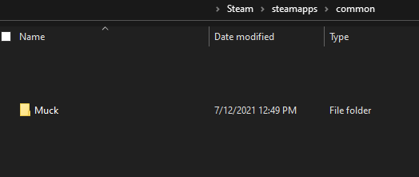
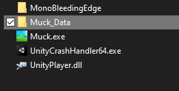
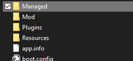

## Muck-Mod-v1.26
# For Muck Version 1.26
This dll file contains the mod!
Dani pls contact me if you want me to remove this

# How to use it
So first you need to locate your Muck data folder,

There you will find the Assembly-CSharp.dll which is the original game dll. Be sure to create a backup for that!
Now, drag or copy-paste in the mod dll file into the folder and replace it.
There you have the mod!
